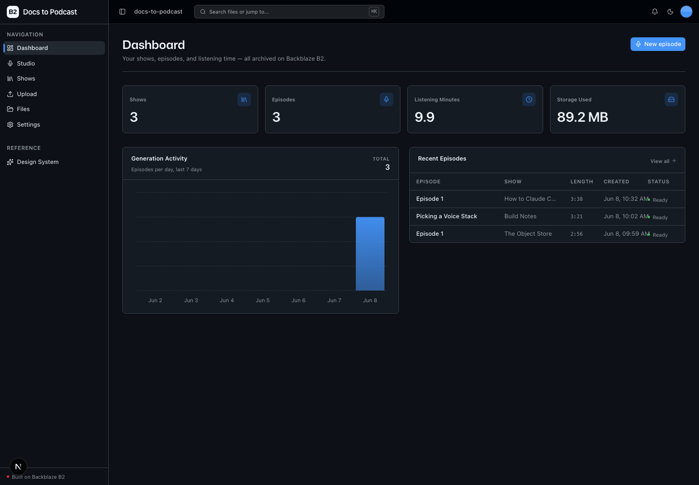
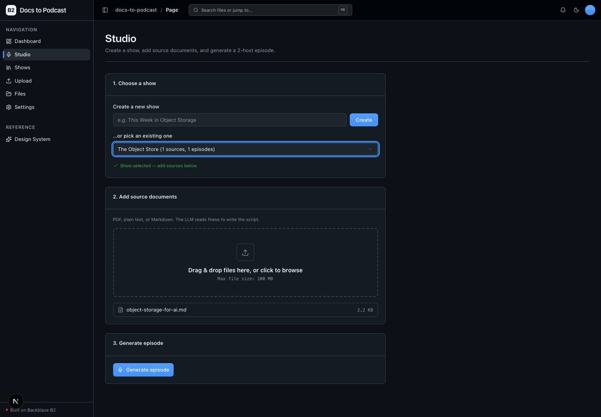
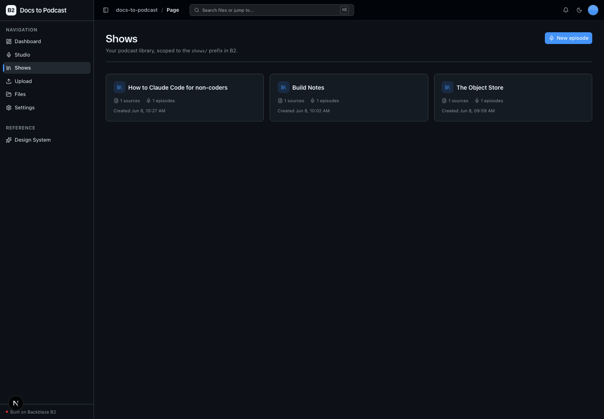

<!-- last_verified: 2026-06-05 -->
# Docs to Podcast

Turn a pile of documents into a conversational, two-host **audio overview** — a NotebookLM-style "podcast generator" built on Backblaze B2. Create a show, drop in PDFs / articles / notes, and the app writes a two-speaker dialogue script with an LLM, renders it to multi-voice audio with TTS, and archives the **sources + transcript + episode audio** together under a per-show / per-episode prefix in **[Backblaze B2](https://www.backblaze.com/sign-up/ai-cloud-storage?utm_source=github&utm_medium=referral&utm_campaign=ai_artifacts&utm_content=b2ai-docs-to-podcast)** cloud storage.

Each episode is a self-contained bundle of related objects — exactly the shape object storage is good at — which makes this a natural demo of B2 for AI artifact storage.

**What you get out of the box:**
- A **Studio** workflow: create a show, add source docs, generate a 2-host episode
- AI **script generation** (OpenAI) turning your sources into a Host A / Host B dialogue
- Multi-voice **audio synthesis** (OpenAI TTS), one voice per host, assembled into one MP3
- A **Shows library** scoped to the `shows/` prefix — listen inline, read the transcript, download any artifact
- A **podcast dashboard**: shows, episodes, listening minutes, storage, generation activity
- The kept **whole-bucket Files explorer** and drag-and-drop **Upload** surface
- A FastAPI backend with strict layered architecture and structural tests, and agent-optimized docs

## What it looks like

**Dashboard** — shows, episodes, listening minutes, and storage used, with a 7-day generation-activity chart and a recent-episodes table.



**Studio** — the three-step workflow to pick or create a show, drop in source documents, and generate a two-host episode.



**Shows** — the podcast library scoped to the `shows/` prefix in B2, each card showing source and episode counts.



## Architecture at a glance

The pipeline is decoupled from upload: source docs live in B2, and generation runs as a FastAPI **background task** that fetches sources back from B2, calls the LLM, synthesizes audio, and writes the result. Episode status (`pending → generating → ready | failed`) is persisted in the episode's B2 manifest, and the UI polls it with TanStack Query, showing the blaze generating loader while work is in flight.

```
shows/{show_id}/show.json                              # show manifest
shows/{show_id}/sources/{filename}                     # uploaded source docs
shows/{show_id}/episodes/{episode_id}/episode.json     # episode manifest (status, voices, timing)
shows/{show_id}/episodes/{episode_id}/transcript.json  # structured 2-host script
shows/{show_id}/episodes/{episode_id}/episode.mp3      # synthesized audio
uploads/{filename}                                     # generic /upload destination
```

B2 is the sole data store — there is no database. All access goes through the **S3-compatible API** via `boto3`, contained in `repo/b2_client.py`, with a custom user agent set on the single shared client. See [ARCHITECTURE.md](ARCHITECTURE.md) for the full layering and data flows.

## Quick Start

You need: Node.js >= 20, pnpm >= 9, Python >= 3.11, a free **[Backblaze B2 account](https://www.backblaze.com/sign-up/ai-cloud-storage?utm_source=github&utm_medium=referral&utm_campaign=ai_artifacts&utm_content=b2ai-docs-to-podcast)**, and an **OpenAI API key** (powers both script generation and TTS).

**1. Install dependencies**

```bash
pnpm install
```

**2. Set up the backend**

```bash
cd services/api
python -m venv .venv && source .venv/bin/activate
pip install -r requirements.txt
cd ../..
```

**3. Add your credentials**

```bash
cp .env.example .env
```

Open `.env` and fill in:

- **Backblaze B2** — head to the [B2 dashboard](https://secure.backblaze.com/b2_buckets.htm?utm_source=github&utm_medium=referral&utm_campaign=ai_artifacts&utm_content=b2ai-docs-to-podcast):
  1. **Create a bucket.** Paste the **Bucket Unique Name** → `B2_BUCKET_NAME`, the **Endpoint** → `B2_ENDPOINT`, and the bucket's **region** (e.g. `us-west-004`) → `B2_REGION`.
  2. **Create an application key** with `Read and Write` permission. Paste the **keyID** → `B2_APPLICATION_KEY_ID` and **applicationKey** → `B2_APPLICATION_KEY` *(shown once)*.
- **OpenAI** — paste your key → `OPENAI_API_KEY`. The default models (`gpt-4o-mini` for the script, `gpt-4o-mini-tts` for audio) and host voices/names are all overridable in `.env`.

> Walkthroughs: [creating a bucket](https://www.backblaze.com/docs/cloud-storage-create-and-manage-buckets?utm_source=github&utm_medium=referral&utm_campaign=ai_artifacts&utm_content=b2ai-docs-to-podcast) and [creating app keys](https://www.backblaze.com/docs/cloud-storage-create-and-manage-app-keys?utm_source=github&utm_medium=referral&utm_campaign=ai_artifacts&utm_content=b2ai-docs-to-podcast). OpenAI keys: [platform.openai.com/api-keys](https://platform.openai.com/api-keys).

**4. Run it**

```bash
pnpm dev
```

Frontend at `localhost:3000`, API at `localhost:8000`. Open **Studio**, create a show, add a PDF or text file, and click **Generate episode**.

`pnpm dev` runs `pnpm doctor` first — a preflight that catches the common setup gotchas (wrong Node/Python version, missing venv, missing or placeholder `.env`, ports in use, missing OpenAI key) and tells you how to fix each one. Run it standalone with `pnpm doctor`.

## Core Features

- [Show Creation & Source Ingestion](docs/features/show-creation.md) — create a show, drag-drop sources into `shows/{id}/sources/`
- [Episode Generation](docs/features/episode-generation.md) — LLM script → multi-voice TTS → archived MP3, run as a background task
- [Shows Library](docs/features/shows-library.md) — scoped explorer over `shows/`, inline player, transcript, downloads
- [Dashboard](docs/features/dashboard.md) — shows, episodes, listening minutes, storage, generation activity
- [File Upload](docs/features/file-upload.md) — generic drag-and-drop upload (also reused for show-scoped ingestion)
- [File Browser](docs/features/file-browser.md) — whole-bucket explorer over every object
- [Metadata Extraction](docs/features/metadata-extraction.md) — image dimensions, EXIF, PDF info, checksums, audio fields
- [Design System](docs/design-system.md) — tokens, primitives, the blaze generating loader, inline error/empty states. Live preview at `/design`.

## Tech Stack

- TypeScript, Next.js 16, React 19, Tailwind v4, shadcn/ui, Recharts
- TanStack Query — caching, dedup, retry, and status polling for every fetch
- Python 3.11+, FastAPI, boto3, Pydantic v2, PyPDF2, Pillow
- **OpenAI** — script generation (LLM) and audio synthesis (TTS), one SDK and one key
- Backblaze B2 (S3-compatible object storage) — the sole data store
- pnpm workspaces (monorepo)

## Commands

| Command | What it does |
|---------|-------------|
| `pnpm dev` | Start frontend + backend |
| `pnpm dev:web` | Frontend only |
| `pnpm dev:api` | Backend only |
| `pnpm build` | Build frontend |
| `pnpm lint` | Lint frontend |
| `pnpm lint:api` | Lint backend (ruff) |
| `pnpm test:api` | Run backend tests (mocked LLM/TTS — no network, no keys) |
| `pnpm check:structure` | Verify layering rules |
| `pnpm test:e2e` | Playwright e2e tests (run `pnpm --filter @docs-to-podcast/web exec playwright install chromium` once first) |

## Documentation Map

| Doc | Purpose |
|-----|---------|
| [AGENTS.md](AGENTS.md) | Agent table of contents — start here |
| [ARCHITECTURE.md](ARCHITECTURE.md) | System layout, layering, generation pipeline, data flows |
| [docs/features/](docs/features/) | Feature docs |
| [docs/design-system.md](docs/design-system.md) | Design tokens, primitives, loader, error/empty states |
| [docs/app-workflows.md](docs/app-workflows.md) | User journeys |
| [docs/dev-workflows.md](docs/dev-workflows.md) | Engineering workflows and testing |
| [docs/SECURITY.md](docs/SECURITY.md) | Security principles |
| [docs/RELIABILITY.md](docs/RELIABILITY.md) | Reliability expectations |
| [docs/exec-plans/](docs/exec-plans/) | Execution plans and tech debt tracker |

## License

MIT License - see [LICENSE](LICENSE) for details.

## Claude Agent B2 Skill

Manage Backblaze B2 from your terminal using natural language (list/search, audits, stale or large file detection, security checks, safe cleanup).

Repo: [https://github.com/backblaze-b2-samples/claude-skill-b2-cloud-storage](https://github.com/backblaze-b2-samples/claude-skill-b2-cloud-storage)
